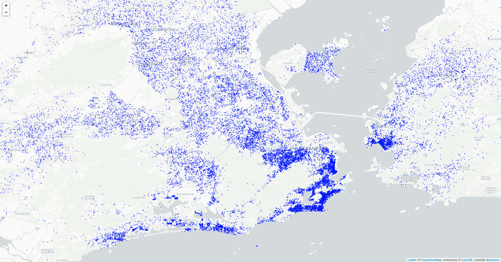
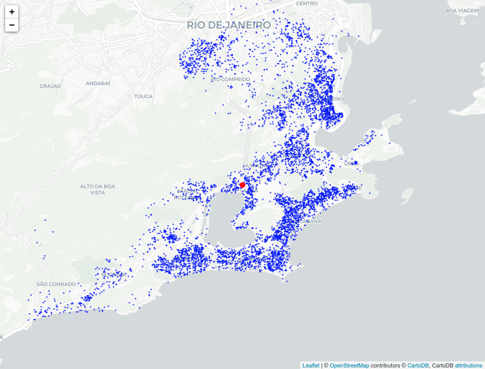
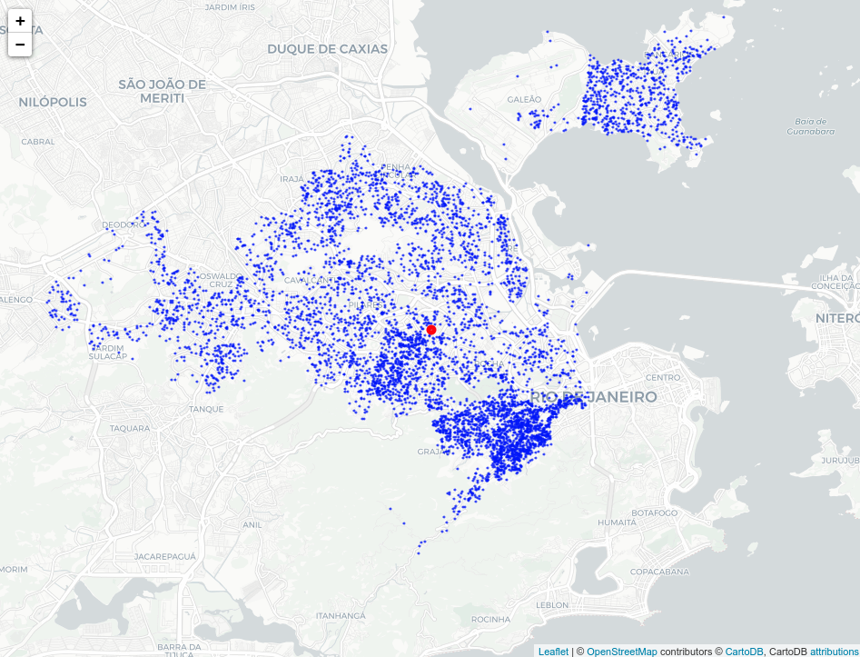
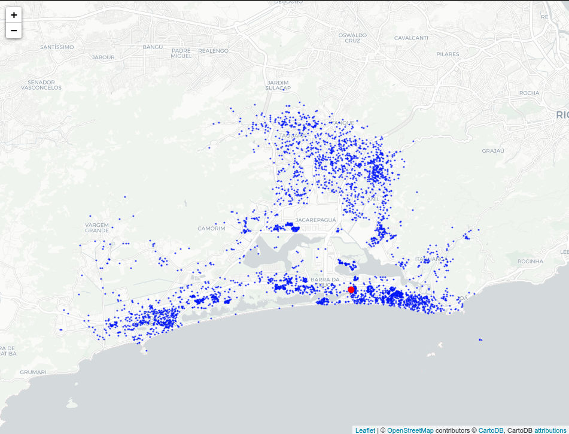
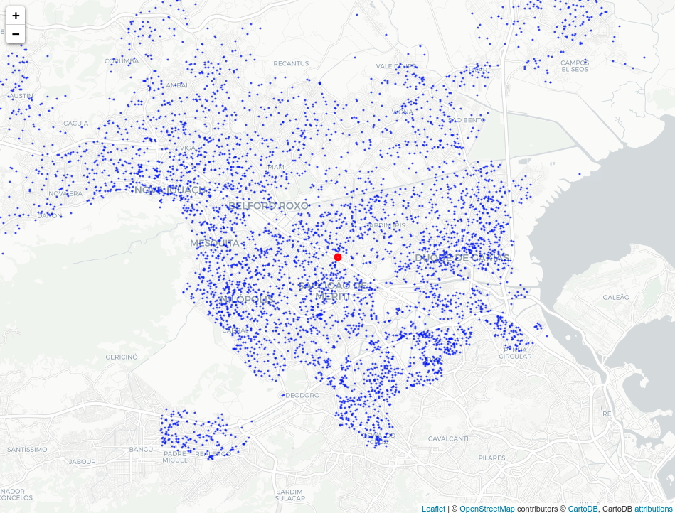

Loggi Benchmark for Urban Deliveries (BUD) 
==================

The Loggi Benchmark for Urban Deliveries contains datasets and benchmark
scripts for large-scale problems using as a testbed some of Brazil's largest
cities. The data is synthesized completely from public sources and
representative of the challenges we face on real world deliveries for the
problems outlined in the repository.

To get started with the development using LoggiBUD, check out our 
[quickstart tutorial](./docs/quickstart.md).

# Dataset

The dataset simulates the challenge of a large delivery company in the
last-mile step of the supply chain. Worldwide, metropolitan areas like Rio de
Janeiro witness the delivery of tens or even hundreds of thousands of parcels
and mail.  Deliveries on those areas are unexpectedly very unevenly
distributed. Rich and densily populated areas drive most of the deliveries.
Besides economic factors, our data also do consider the geography of the
represented locations and real street travel distances, as the reality of
complex cities is not well modelled by euclidian distances.

On our first version, We provide 90 train instances and 30 evaluation instances
for the end-to-end problem on Rio de Janeiro (RJ), Brasília (DF) and Belém (PA).
The instance sizes range from 7k to 32k deliveries. The challenge is to position
consolidation hubs across the city and split demands into delivery vehicles. 

<p float="center">  </p>

While our goal is to solve the problem on an end-to-end manner, we also provide
a baseline distribution of demands into 11 hubs obtained using a p-hub
assignment. This leads to 990 train instances and 330 evaluation instances on
the CVRP challenge.

<p float="center">     </p>

# Tasks

### Task 1 - Last-Mile Capacitated Vehicle Routing Problem

This first task is a classic Capacitated Vehicle Routing Problem (CVRP) with
minimizing travel distance as objetive. Although solving such large CVRPs with
complete information is often impractical, these solutions are good targets for
Task 2.

### Task 2 - Last-Mile Incremental Capacitated Vehicle Routing Problem

This is considered a particular case of Stochastic and Dynamic Capacitated
Vehicle Routing Problems (SD-CVRP). The objetive is to sort deliveries into
routes one by one as they arrive. You may use only historical information and
the previously routed deliveries from the same instance. No recombination is
allowed after assignment.

From an operations point of view, this solution class is a lot more powerful as
it doesn't require full information before start routing. Instead, hub
operators can route deliveries as they arrive.

### Task 3 - End-to-end last-mile problem

This is an extension of the task 1.2, but without fixed dispatch locations.
Therefore, locations and allocation of requests to dispatch locations is
considered part of the solution, but should be the same accross multiple
instances. This can be considered an end-to-end optimization of last-mile
delivery operations.

# Motivation

This benchmark is an effort to make new operations research solutions closer to
real-world applications faced by delivery companies. We believe this work can
help both practitioners and academics to reduce the gap between
state-of-the-art and practice.

We identify that several promising solutions in academic literature have
evaluation issues. Several papers only include experiments for small or
unrealistic problems. We also expected real-world instances to help researchers
to come up with new ideas for solving large routing and location problems.

### Why a new dataset

There are several famous datasets for the Vehicle Routing Problem (VRP).
However, there are limitations to these instances that make them hard to apply
to real-world last-mile problems. Some of them include:

* Small instances
* Ignore streets, use only euclidean distances
* No discussion on aggregation levels

Most instances also fail to model real challenges of dynamic and stochastic
instances, where the stochastic information is usually presented as
probabilities on deterministic points. We instead present stochastic
information as historical deliveries performed under the same distribution.

### Why a GitHub benchmark

We want to make publishing results as easy as opening a pull-request. We also
want to provide you with code to evaluate your solution and make sure it's
ready for publication. If you're not familiar with making open-source
contributions, don't worry. Open an issue, and we'll be happy to guide you with
your submission.


# How to submit

To include your method to the benchmark leaderboards, you must submit the
solution data into a pull request.

While submitting the code is not required, we strongly suggest making your
research code available to make reproducing the results more accessible. You
can publish the code on your repository and include a link on your submission.
We also have some baselines on this repository. If you want to include your
code as a baseline, we'll be happy to revise it.

Don't forget to acknowledge the literature and code you have used on your
solution.

# Instance generation pipeline

If you want more details on how we generate our instances and how they relate
to actual deliveries, please check our [generation pipeline
documentation](./generation.md). It also includes the steps for reproducing the
provided instances.


# Citing this work

If you use this data in academic work, please cite our repository. A full paper
describing it should be available soon.

```@misc{Charles2013,
  author = {Loggi},
  title = {loggiBUD: Loggi Benchmark for Urban Deliveries},
  year = {2021},
  publisher = {GitHub},
  journal = {GitHub repository},
  howpublished = {\url{https://github.com/loggi/loggibud}}
}
```

# Disclaimer

This repository is not an official Loggi product. Use it at your own risk under
the terms of the MIT license.
